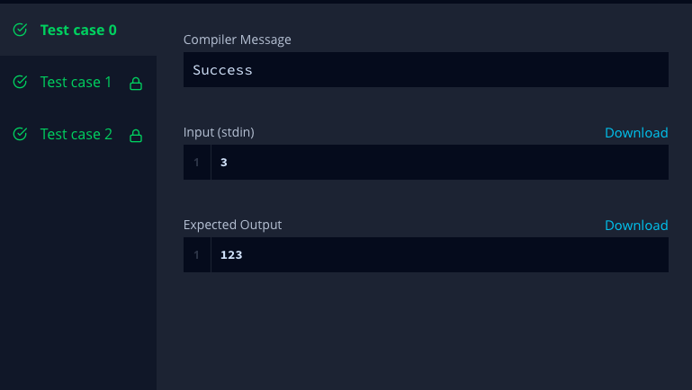

The included code stub will read an integer, ***n*** , from STDIN.

Without using any string methods, try to print the following:
***123.....n***

Note that "***...***" represents the consecutive values in between.

# Example 

Print the string ***12345***.

# Input Format

The first line contains an integer ***n***.

# Constraints

***1 ≤ n ≤ 150***

# Output Format

Print the list of integers from ***1*** through ***n*** as a string, without spaces.

# Sample Input 0

```3```

# Sample Output 0

```123```

# Solution

```from __future__ import print_function
if __name__ == '__main__':
    n = int(raw_input())
# Solution Starts
for x in range(n):
    print(x+1,end = "");
# Solution Ends 
```

# Submission Code


