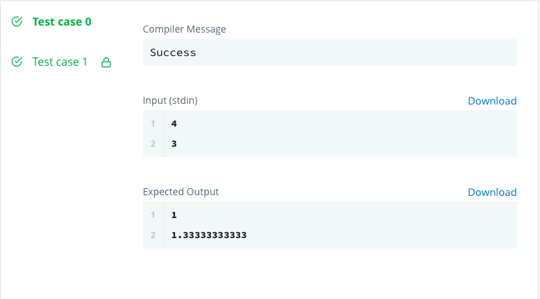

## Task

The provided code stub reads two integers, ***a***  and ***b***, from STDIN.

Add logic to print two lines. The first line should contain the result of integer division, ***a*** // ***b***. The second line should contain the result of float division, ***a*** / ***b***.

No rounding or formatting is necessary.

## Example

***a = 5***

***b = 2***

- The result of the integer division ***3//5= 0***.

-The result of the float division is ***3/5= 0.6***.

Print:
```
0
0.6
```

## Input Format

The first line contains the first integer, ***a***.

The second line contains the second integer, ***b***.

## Output Format

Print the two lines as described above.

## Sample Input 0
```
4
3
```
Sample Output 0
```
1
1.33333333333
```

# Solution

```
from **future** import division

if **name** == '**main**':
    a = int(raw_input())
    b = int(raw_input())

# Solution starts

    one = a // b
    two = a / b
    print(one);
    print(two)

# Solution Ends
```

# Submission Code


